# Network Infrastructure Administration & Firewall Security

Enterprise-style network infrastructure project demonstrating segmentation, routing, firewall policy, secure connectivity, traffic analysis, logging, and administrative troubleshooting.

## Executive Summary

This project simulates the design, deployment, administration, security, troubleshooting, and validation of a segmented enterprise-style network environment using pfSense, Windows 11, Kali Linux, Oracle VirtualBox, Nmap, Wireshark, and OpenVPN.

The environment was built around pfSense as the central firewall, router, NAT gateway, DNS resolver, and remote-access VPN endpoint.

Multiple network zones were created to separate management, server, user, security, corporate-device, guest, VoIP, and DMZ traffic. Firewall policy was then used to control communication between those segments according to least-privilege and default-deny principles.

The project was intentionally designed as more than a basic firewall lab. It incorporates enterprise-style administrative workflows including subnet design, segmentation, Layer 3 routing, DHCP, DNS, NAT, management-plane isolation, controlled inter-network access, remote-access VPN, packet analysis, firewall logging, security validation, troubleshooting, and final operational verification.

> **Evidence:** The README highlights selected screenshots that best demonstrate each capability. The complete chronological evidence trail is available in the [`screenshots/`](screenshots/) directory and the [`documentation/evidence-index.md`](documentation/evidence-index.md) file.

---

## Business Scenario

EllisTech is a fictional organization requiring segmented network infrastructure capable of supporting secure administrative access, internal server workloads, employee systems, security assessment activity, corporate devices, guest Internet access, voice services, DMZ-hosted resources, and remote users.

The environment needed to support:

- centralized firewall and routing administration
- separate network zones based on system purpose and trust level
- controlled communication between users and internal services
- restricted administrative access to network infrastructure
- dynamic addressing for selected client networks
- DNS services for both internal and public name resolution
- outbound Internet access through NAT
- isolated guest access
- controlled DMZ access
- security-assessment traffic from a dedicated pentest segment
- remote access through VPN
- packet-level traffic validation
- firewall logging and event review
- repeatable troubleshooting and validation

The goal was to build a network environment using administrative practices that could scale into a larger enterprise infrastructure deployment.

---

## Project Objectives

The project objectives were to:

- deploy pfSense as the central firewall and router
- design enterprise-style VLAN and subnet architecture
- configure segmented Management, Server, User, Security, Corporate, Guest, VoIP, and DMZ networks
- configure Layer 3 gateways and routing
- deploy a dedicated management workstation
- configure Kea DHCP for selected networks
- configure internal and public DNS dependencies
- apply least-privilege inter-network firewall policy
- enforce default-deny behavior
- restrict pfSense administration to the Management network
- configure outbound NAT and validate Internet access
- isolate Guest traffic from internal RFC1918 networks
- restrict DMZ connectivity to approved dependencies
- validate security controls with Kali Linux and Nmap
- inspect approved traffic with Wireshark
- review blocked traffic in pfSense firewall logs
- configure secure remote access using OpenVPN
- troubleshoot network, DNS, routing, firewall, and infrastructure failures
- validate final network functionality before publication

---

## Lab Architecture

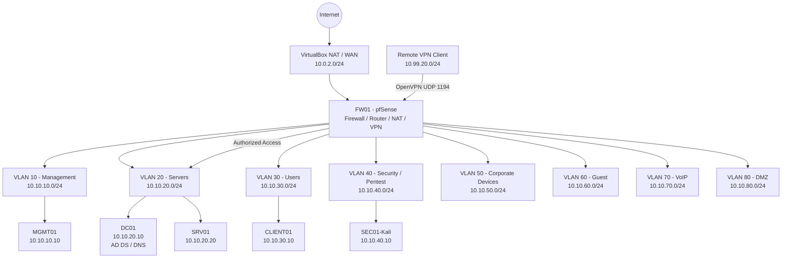
```mermaid
flowchart TB

    INTERNET((Internet))
    WAN[VirtualBox NAT / WAN<br/>10.0.2.0/24]
    FW[FW01 - pfSense<br/>Firewall / Router / NAT / VPN]

    INTERNET --> WAN --> FW

    FW --> MGMT[VLAN 10 - Management<br/>10.10.10.0/24]
    FW --> SERVERS[VLAN 20 - Servers<br/>10.10.20.0/24]
    FW --> USERS[VLAN 30 - Users<br/>10.10.30.0/24]
    FW --> SECURITY[VLAN 40 - Security / Pentest<br/>10.10.40.0/24]
    FW --> CORP[VLAN 50 - Corporate Devices<br/>10.10.50.0/24]
    FW --> GUEST[VLAN 60 - Guest<br/>10.10.60.0/24]
    FW --> VOIP[VLAN 70 - VoIP<br/>10.10.70.0/24]
    FW --> DMZ[VLAN 80 - DMZ<br/>10.10.80.0/24]

    MGMT --> MGMT01[MGMT01<br/>10.10.10.10]
    SERVERS --> DC01[DC01<br/>10.10.20.10<br/>AD DS / DNS]
    SERVERS --> SRV01[SRV01<br/>10.10.20.20]
    USERS --> CLIENT01[CLIENT01<br/>10.10.30.10]
    SECURITY --> KALI[SEC01-Kali<br/>10.10.40.10]

    VPNCLIENT[Remote VPN Client<br/>10.99.20.0/24] -->|OpenVPN UDP 1194| FW
    FW -->|Authorized Access| SERVERS
```

### Environment

| System / Segment | Address | Role |
|---|---|---|
| FW01-pfSense WAN | `10.0.2.15/24` | Internet-facing firewall interface through VirtualBox NAT |
| Management | `10.10.10.0/24` | Firewall and infrastructure administration |
| MGMT01 | `10.10.10.10` | Dedicated management workstation |
| Servers | `10.10.20.0/24` | Server workloads |
| DC01 | `10.10.20.10` | Active Directory Domain Services and DNS |
| SRV01 | `10.10.20.20` | Member server |
| Users | `10.10.30.0/24` | Domain-user workstations |
| CLIENT01 | `10.10.30.10` | Windows 11 domain workstation |
| Security / Pentest | `10.10.40.0/24` | Controlled assessment network |
| SEC01-Kali | `10.10.40.10` | Kali Linux validation system |
| Corporate Devices | `10.10.50.0/24` | Managed corporate-device network |
| Guest | `10.10.60.0/24` | Internet access with internal isolation |
| VoIP | `10.10.70.0/24` | Logical voice-services segment |
| DMZ | `10.10.80.0/24` | Restricted externally facing services |
| Remote Access VPN | `10.99.20.0/24` | OpenVPN client tunnel network |

> **Lab implementation note:** Logical VLAN segmentation was designed in pfSense. Because Oracle VirtualBox does not emulate a managed switch in the same way as production hardware, live test segments were implemented using isolated VirtualBox Internal Networks mapped to dedicated pfSense virtual interfaces. In a production environment, these segments would typically be implemented with managed switches and IEEE 802.1Q trunks.

### Infrastructure Evidence

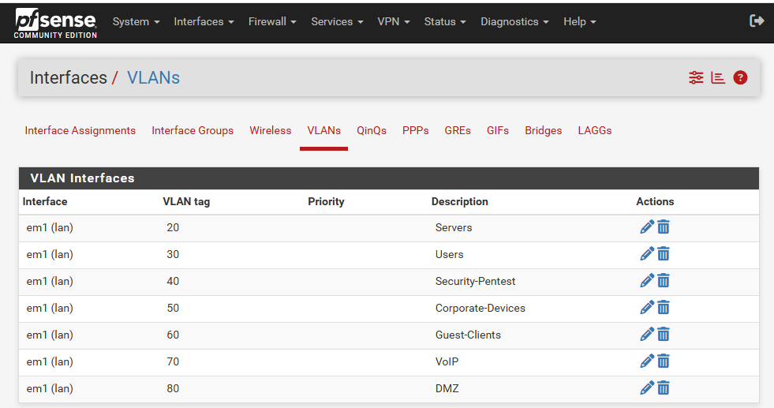

*Enterprise VLAN architecture covering Management, Servers, Users, Security, Corporate Devices, Guest, VoIP, and DMZ.*

---

## Technologies Used

- pfSense
- VLAN architecture
- TCP/IP
- IPv4 subnetting
- Layer 3 routing
- ARP
- Kea DHCP
- DNS
- NAT
- OpenVPN
- Nmap
- Wireshark
- Kali Linux
- Windows 11
- Windows Server 2025
- Active Directory Domain Services
- Oracle VirtualBox
- PowerShell
- Git
- GitHub
- Visual Studio Code

---

# Implementation

## 1. pfSense Deployment & Core Networking

pfSense was deployed as the central firewall and routing platform for the environment.

Initial configuration included:

```text
WAN: em0
WAN Address: 10.0.2.15/24

Management / LAN: em1
Gateway: 10.10.10.1/24
```

The firewall was installed in Oracle VirtualBox and connected to:

- a VirtualBox NAT network for WAN access
- isolated Internal Networks for enterprise segments

After installation, the pfSense WebGUI was used for ongoing administration.

---

## 2. Network Segmentation & VLAN Design

The network was divided into multiple logical security zones.

| Segment | VLAN | Network | Gateway |
|---|---:|---|---|
| Management | 10 | `10.10.10.0/24` | `10.10.10.1` |
| Servers | 20 | `10.10.20.0/24` | `10.10.20.1` |
| Users | 30 | `10.10.30.0/24` | `10.10.30.1` |
| Security / Pentest | 40 | `10.10.40.0/24` | `10.10.40.1` |
| Corporate Devices | 50 | `10.10.50.0/24` | `10.10.50.1` |
| Guest | 60 | `10.10.60.0/24` | `10.10.60.1` |
| VoIP | 70 | `10.10.70.0/24` | `10.10.70.1` |
| DMZ | 80 | `10.10.80.0/24` | `10.10.80.1` |

The design separates systems by purpose and trust level rather than placing all devices on a flat network.

### Evidence


*Logical segmentation plan implemented in pfSense.*

---

## 3. Routing, DHCP & DNS

pfSense provides Layer 3 gateway services for each segmented network.

Routing was validated using:

- gateway testing
- ARP neighbor discovery
- routing-table inspection
- cross-network service tests

Kea DHCP was enabled for networks where dynamic client addressing was appropriate.

Dynamic addressing was used for selected endpoint-oriented networks, while infrastructure, management, server, security, and DMZ systems used controlled static addressing.

Internal DNS services are provided by `DC01` at:

```text
10.10.20.10
```

Guest systems use pfSense as their resolver rather than communicating directly with the internal Domain Controller.

### Evidence

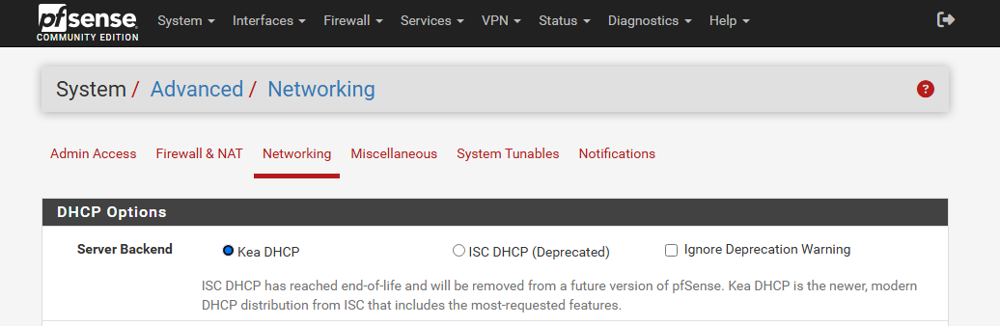

*pfSense configured to use the Kea DHCP backend.*

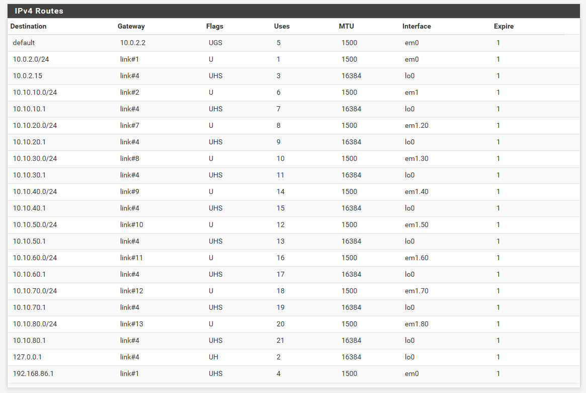

*pfSense routing table demonstrating routes to the segmented networks.*

---

## 4. Management Plane Isolation

A dedicated Windows 11 workstation, `MGMT01`, was created for firewall administration.

```text
MGMT01
IP: 10.10.10.10/24
Gateway: 10.10.10.1
```

pfSense administration was validated from the Management network.

User-network attempts to reach the pfSense management interface were denied.

### Evidence

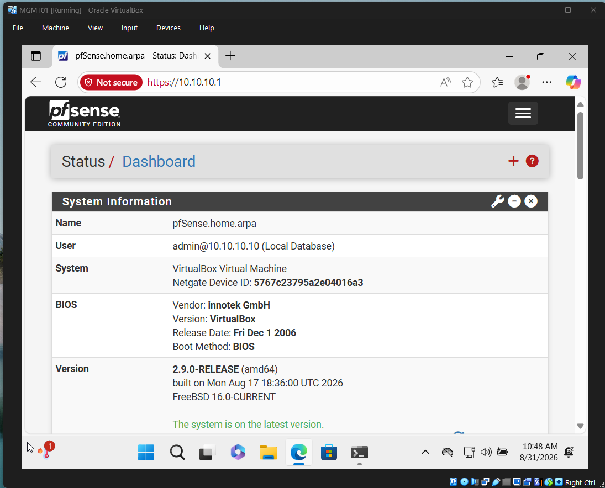

*Successful pfSense administration from the dedicated Management workstation.*

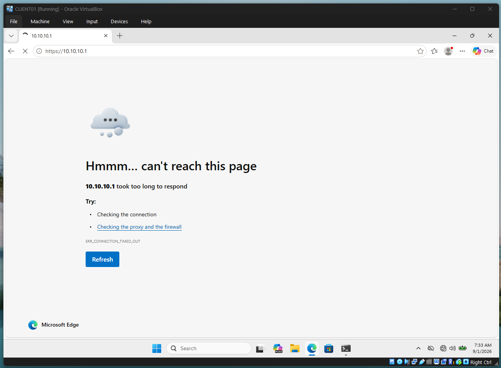

*CLIENT01 on the User network denied access to the pfSense management interface.*

---

## 5. Firewall Policy & Access Control

The firewall uses a **default-deny** approach.

Inter-network traffic is permitted only where a documented business, administrative, or infrastructure dependency exists.

Examples include:

- Users may reach required DNS and Active Directory services
- Users may not reach unapproved server services
- Security/Pentest systems receive controlled assessment access
- Corporate Devices may use approved internal dependencies
- Guest systems may reach the Internet but not internal RFC1918 networks
- DMZ systems receive only narrowly defined internal access
- VPN clients may reach approved protected resources

Two reusable aliases were created.

### AD_CORE_SERVICES

```text
Kerberos: 88
LDAP: 389
Kerberos Password Operations: 464
```

### RFC1918_NETWORKS

```text
10.0.0.0/8
172.16.0.0/12
192.168.0.0/16
```

The RFC1918 alias is used to block Guest traffic from private/internal networks while still permitting Internet access.

### Evidence

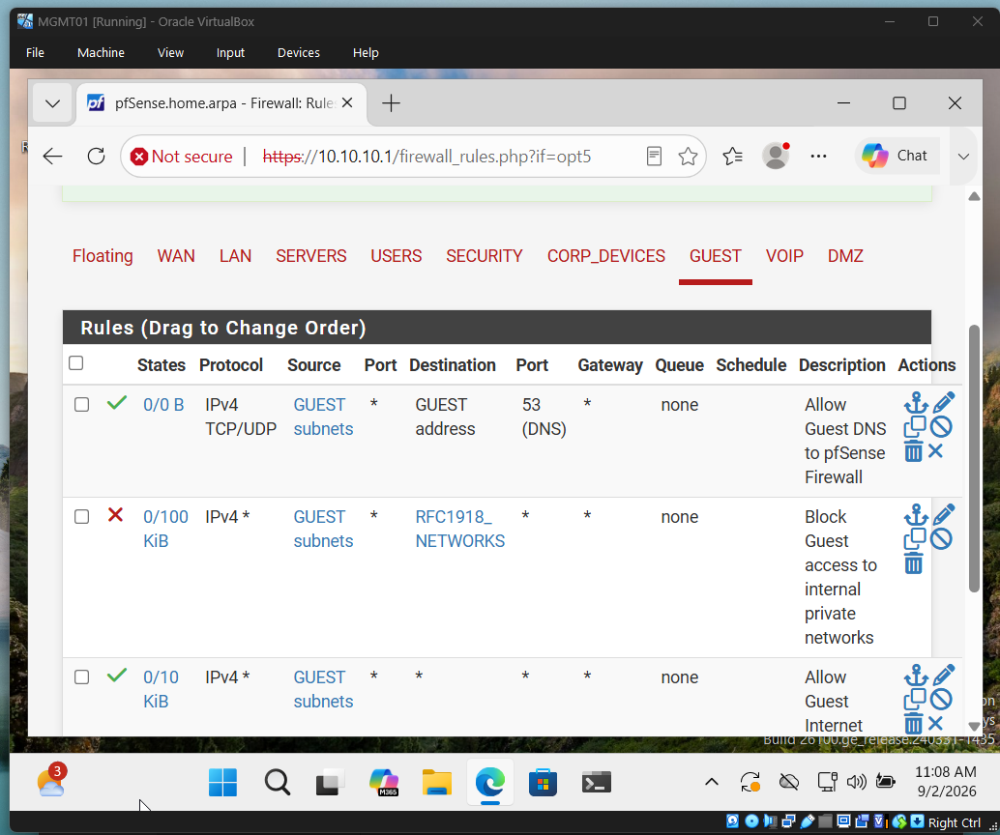

*Guest policy allows DNS to pfSense, blocks RFC1918 destinations, and permits Internet access.*

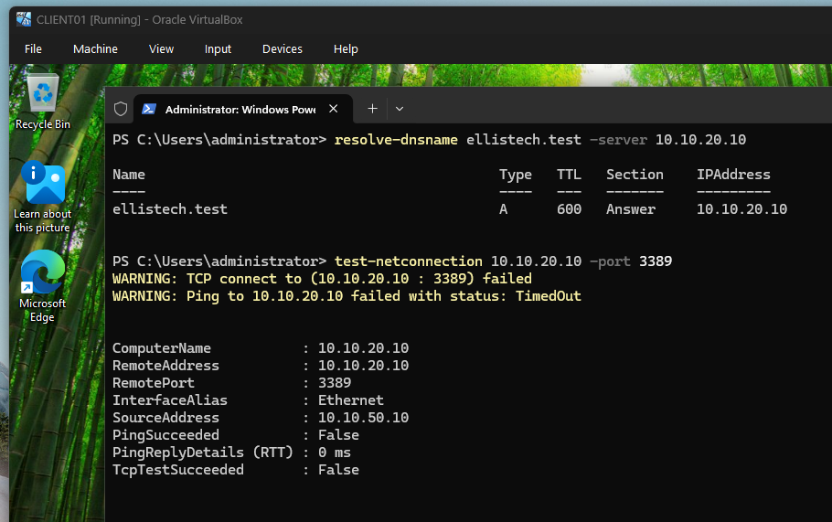

*Corporate endpoint allowed an approved service while an unapproved service remained inaccessible.*

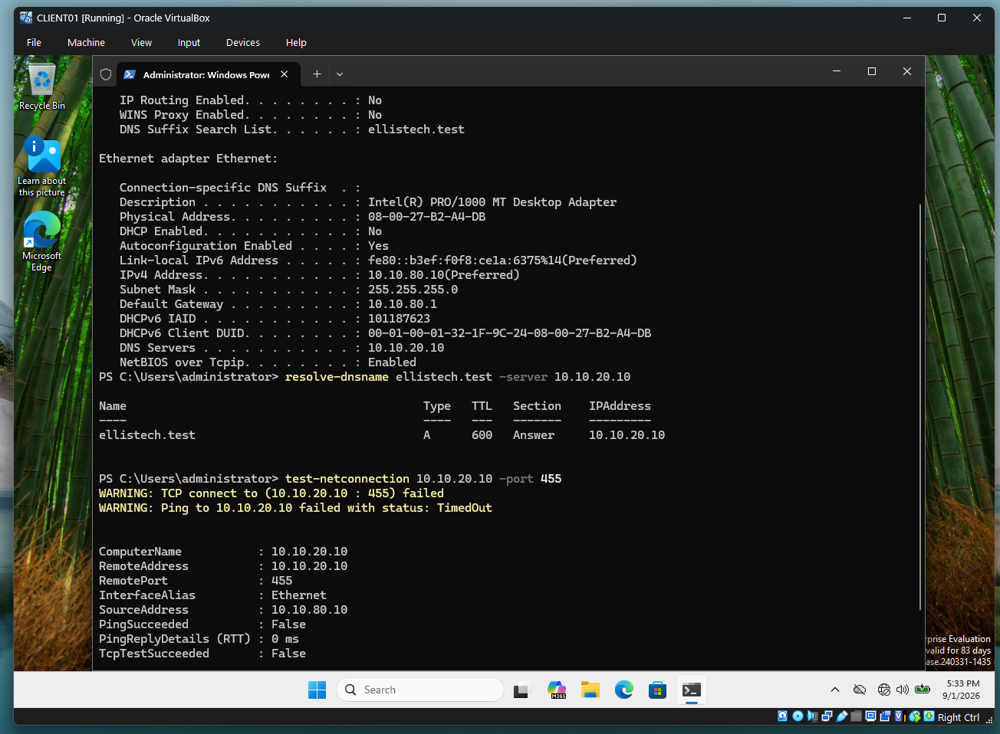

*DMZ endpoint restricted to narrowly defined internal access.*

Full firewall policy:

[Firewall Policy Matrix](documentation/firewall-policy-matrix.md)

---

## 6. NAT & Internet Connectivity

pfSense Automatic Outbound NAT was used to translate private internal addresses through the WAN interface.

Automatic NAT rules were generated for the internal segmented networks.

Guest Internet access was validated from:

```text
CLIENT01
10.10.60.10
```

The endpoint successfully:

- reached public IPv4 destinations
- resolved public DNS names
- established outbound HTTPS connectivity

while remaining isolated from internal private networks.

### Evidence

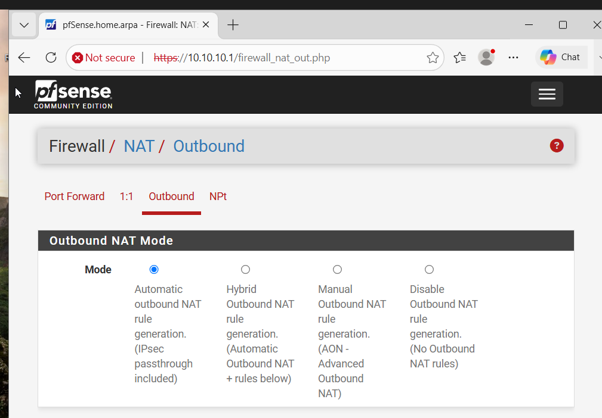

*pfSense Automatic Outbound NAT configuration.*

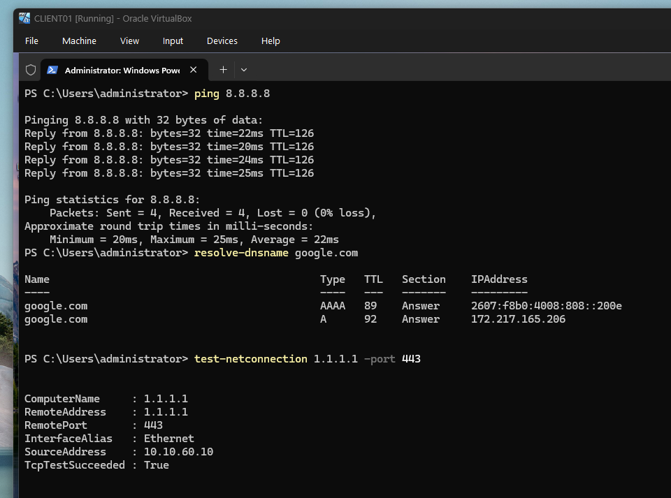

*Guest client successfully using DNS and Internet connectivity through pfSense.*

---

## 7. Security Validation With Kali Linux & Nmap

Kali Linux was placed on the dedicated Security/Pentest segment:

```text
SEC01-Kali
10.10.40.10/24
Gateway: 10.10.40.1
```

Nmap was used to validate firewall exposure against `DC01`.

```bash
nmap -Pn -sT -p 53,88,389,445,3389 10.10.20.10
```

Observed results:

| Port | Service | Result |
|---:|---|---|
| 53/tcp | DNS | Filtered |
| 88/tcp | Kerberos | Open |
| 389/tcp | LDAP | Filtered |
| 445/tcp | SMB | Filtered |
| 3389/tcp | RDP | Filtered |

The results confirmed that the Security/Pentest network could reach the explicitly approved Kerberos service while the other tested services remained filtered.

### Evidence

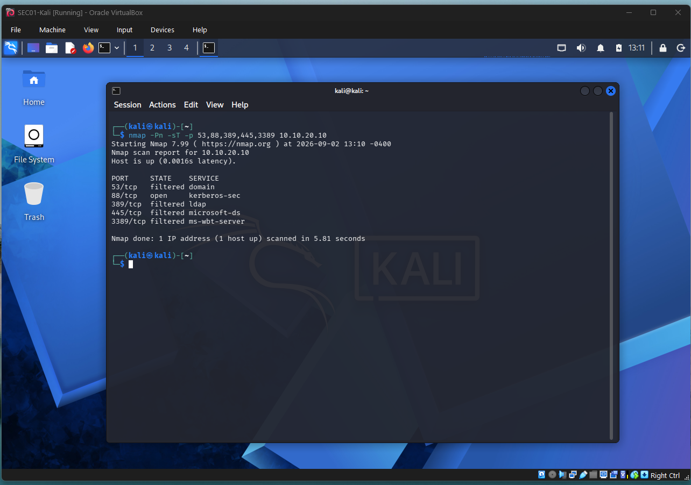

*Nmap used to validate actual exposure against the intended firewall policy.*

---

## 8. Wireshark Packet Analysis

Wireshark was used on `SEC01-Kali` to analyze the approved Kerberos connection.

Traffic path:

```text
10.10.40.10 → 10.10.20.10:88
```

The packet capture showed the TCP three-way handshake:

```text
SYN
SYN, ACK
ACK
```

This confirmed that the approved connection was successfully established through pfSense.

### Evidence

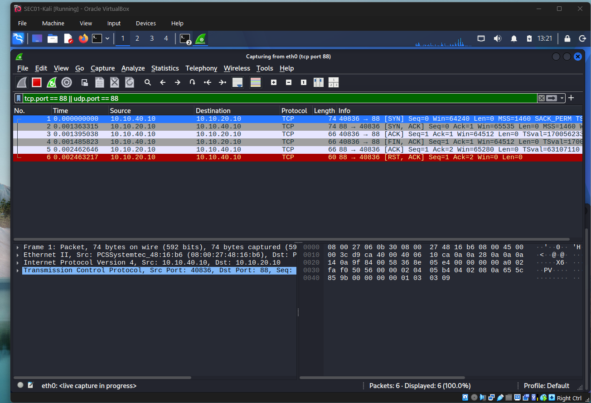

*Packet-level confirmation of the approved Kerberos connection between the Security and Server networks.*

---

## 9. Firewall Logging

Blocked traffic was reviewed through pfSense firewall logs.

The firewall log provided:

- interface
- source address
- destination address
- destination port
- matched rule
- deny action

A DMZ-originated connection to an internal server was denied by the default IPv4 rule and recorded for administrative review.

### Evidence

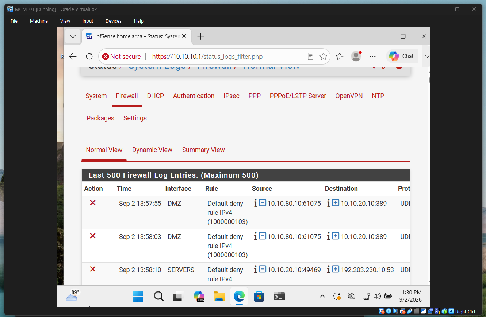

*pfSense log entry showing denied DMZ-originated traffic.*

---

## 10. Secure Remote Access With OpenVPN

A remote-access OpenVPN service was configured on pfSense.

The implementation included:

- UDP port `1194`
- dedicated Certificate Authority
- server certificate
- user certificate
- local user authentication
- dedicated VPN tunnel network
- authorized access to protected internal resources

A Windows OpenVPN client successfully connected and received:

```text
10.99.20.2
```

The client then successfully accessed an approved service on `DC01`.

### Evidence

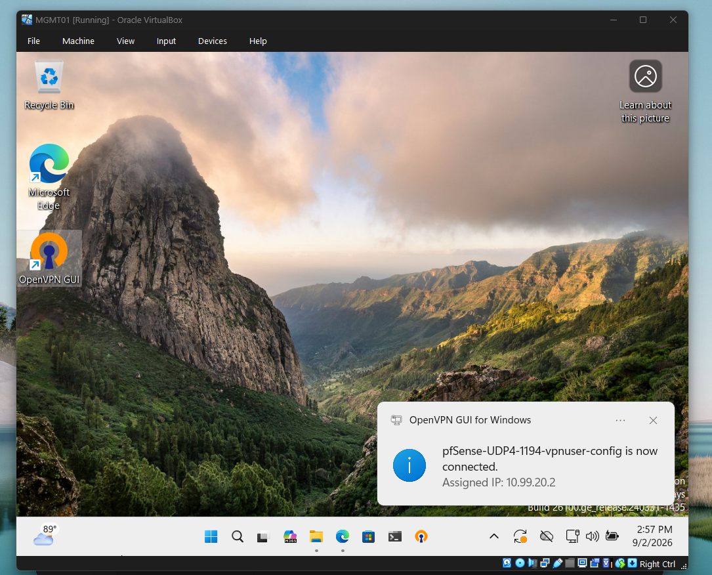

*Windows OpenVPN client connected and assigned a tunnel IP address.*

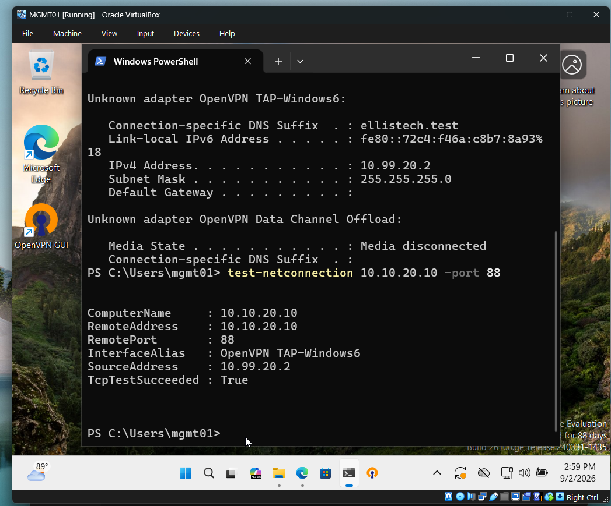

*VPN client successfully reaching an approved protected internal service.*

---

# Troubleshooting and Recovery

A major objective of this project was to demonstrate administrative troubleshooting rather than only successful configuration.

Naturally occurring and controlled failures were investigated, corrected, and validated.

---

## Cross-VLAN DNS & Active Directory Discovery Failure

After moving `CLIENT01` to the User network, the workstation had valid IP addressing and local gateway connectivity but could not use domain-related services.

Symptoms included:

- DNS queries to `10.10.20.10` timing out
- internal-domain resolution failure
- `nltest /dsgetdc:ellistech.test` failure

A targeted DNS firewall rule was created:

```text
Source: Users
Destination: 10.10.20.10
Protocol: TCP/UDP
Port: 53
```

DNS resolution then succeeded.

However, Active Directory discovery still failed.

Additional required services were identified and added through the `AD_CORE_SERVICES` alias:

```text
88  - Kerberos
389 - LDAP
464 - Kerberos Password Operations
```

After applying the targeted Active Directory firewall rule:

- DNS resolution succeeded
- Domain Controller discovery succeeded
- unrelated server services remained blocked

Troubleshooting path:

```text
IP Connectivity
    ↓
DNS
    ↓
Active Directory Dependencies
    ↓
Firewall Policy
    ↓
Validation
```

### Evidence

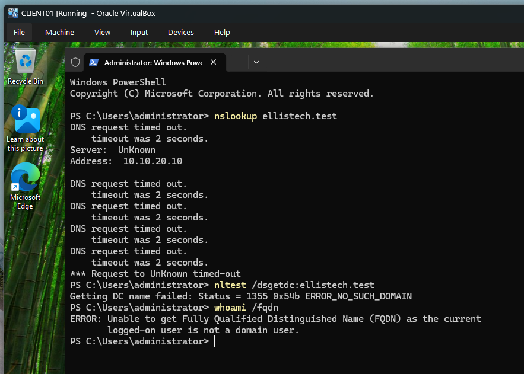

*Initial DNS and Active Directory communication failure after segmentation.*

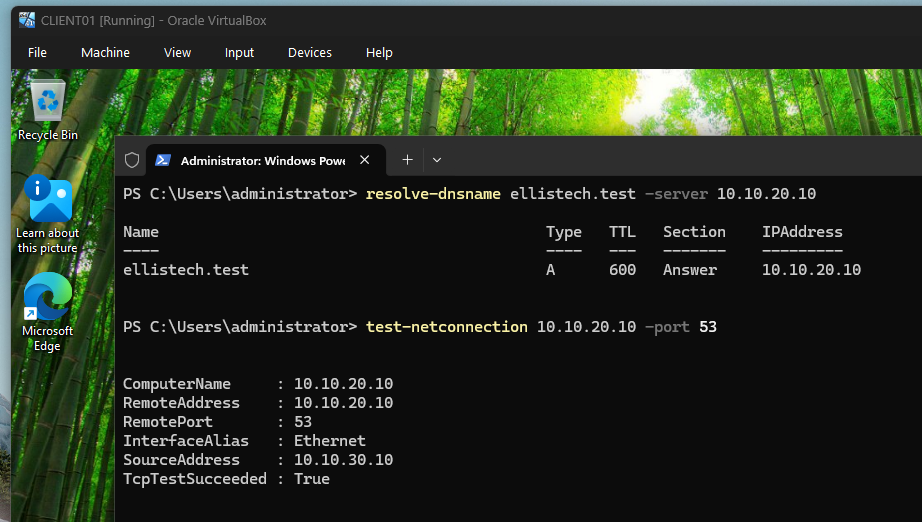

*Cross-VLAN DNS successfully restored through a targeted firewall rule.*

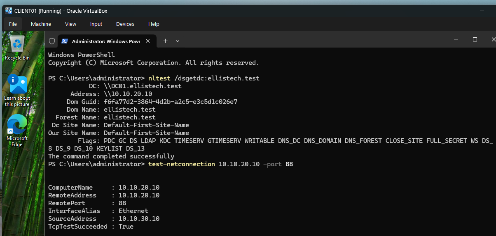

*Active Directory Domain Controller discovery restored after permitting required services.*

---

## Network Path & Firewall Availability

During User-network validation, `CLIENT01` had the expected static address but could not reach:

```text
10.10.30.1
```

Troubleshooting included:

- validating endpoint addressing
- checking the VirtualBox network path
- reviewing ARP behavior
- verifying firewall availability

`FW01-pfSense` was found to be offline.

After restoring the firewall, CLIENT01 successfully learned the User-gateway MAC address through ARP.

ICMP still failed.

This revealed a second condition: the default-deny firewall policy was blocking the gateway test.

A narrowly scoped ICMP rule was added for validation.

Troubleshooting path:

```text
Endpoint
    ↓
Virtual NIC
    ↓
Layer 2 Segment
    ↓
Firewall Availability
    ↓
ARP
    ↓
Firewall Policy
    ↓
Validation
```

### Evidence

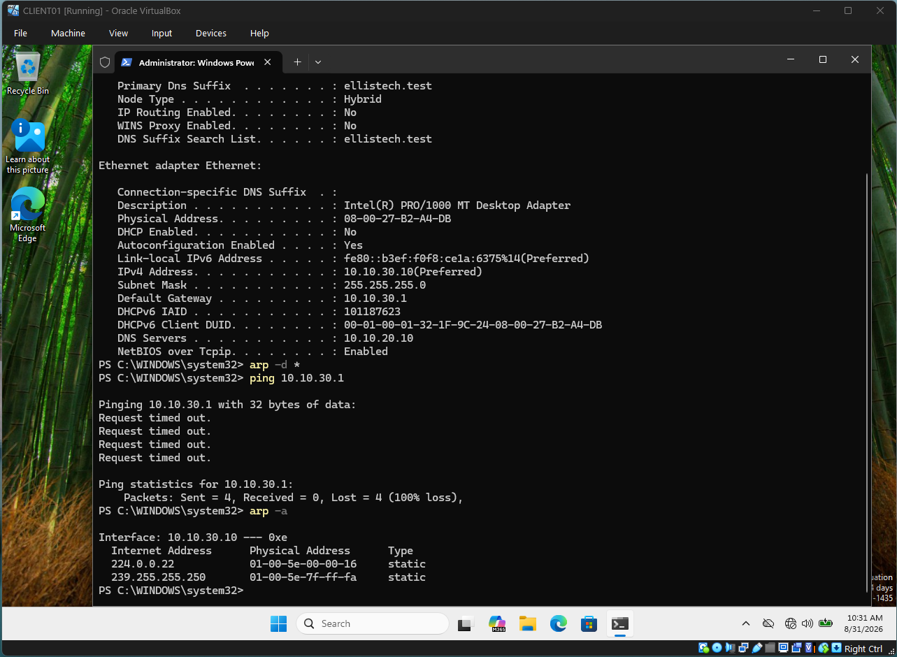

*User gateway unavailable while pfSense was offline.*

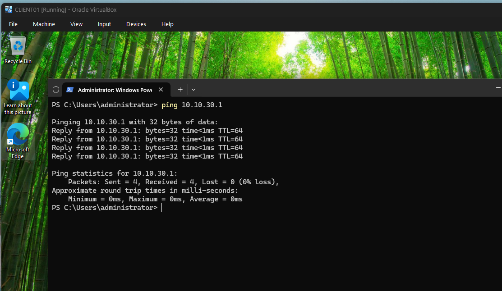

*Gateway connectivity successfully restored after infrastructure and policy remediation.*

Full troubleshooting documentation:

[Troubleshooting Case Studies](documentation/troubleshooting-case-studies.md)

---

# Final Validation

Before publication, the environment underwent a final validation sweep.

| Area | Validation Method | Result |
|---|---|---|
| pfSense Administration | Management WebGUI access | PASS |
| Management Isolation | User-to-pfSense HTTPS test | PASS |
| VLAN / Segment Design | Interface and addressing review | PASS |
| Routing | Gateway / route validation | PASS |
| DHCP | Kea configuration review | PASS |
| Internal DNS | Cross-VLAN query validation | PASS |
| Active Directory Dependencies | Domain Controller discovery | PASS |
| User-to-Server Policy | Approved and denied service testing | PASS |
| Security/Pentest Policy | Kali / Nmap validation | PASS |
| Corporate Policy | Positive and negative service testing | PASS |
| Guest Isolation | Internal-deny / Internet-allow testing | PASS |
| DMZ Restriction | Controlled internal access testing | PASS |
| NAT | Outbound Internet connectivity | PASS |
| Wireshark | TCP handshake analysis | PASS |
| Firewall Logging | Default-deny log validation | PASS |
| OpenVPN | Tunnel and protected-resource access | PASS |

---

# Key Challenges and Lessons Learned

## Logical VLAN Design vs. Virtual Lab Implementation

The project reinforced the distinction between enterprise network architecture and the capabilities of the virtualization platform.

Logical VLANs were designed in pfSense, while live endpoint segments were represented using isolated VirtualBox Internal Networks and dedicated virtual firewall interfaces.

The implementation differed from a physical managed-switch environment, but the security and routing concepts remained the same.

---

## Troubleshooting by Network Layer

Multiple failures produced similar symptoms but originated at different layers.

Examples included:

- firewall unavailable
- ARP failure
- firewall policy blocking ICMP
- DNS blocked across VLANs
- Active Directory service dependencies missing from firewall policy
- incorrect Guest DNS configuration

The project reinforced the value of troubleshooting systematically rather than changing multiple settings at once.

---

## Least Privilege vs. Broad Connectivity

Several services could have been restored quickly by permitting broad traffic between networks.

Instead, the environment used narrowly scoped rules and reusable aliases.

This preserved segmentation while allowing required business and infrastructure dependencies.

---

## Validating Configuration With Independent Tools

A rule appearing in pfSense was not treated as sufficient proof that the intended control worked.

Validation used:

- PowerShell
- Kali Linux
- Nmap
- Wireshark
- pfSense firewall logs

This provided configuration evidence, active testing, packet-level evidence, and operational logging.

---

# Skills Demonstrated

This project demonstrates hands-on experience with:

- pfSense administration
- network architecture
- TCP/IP
- IPv4 subnetting
- VLAN design
- network segmentation
- routing
- ARP
- DHCP
- DNS
- NAT
- firewall policy
- default-deny security
- least-privilege access control
- network aliases
- management-plane isolation
- Guest network isolation
- DMZ security
- OpenVPN
- Certificate Authority management
- remote-access VPN
- Kali Linux
- Nmap
- Wireshark
- TCP handshake analysis
- firewall logging
- PowerShell connectivity testing
- network troubleshooting
- root-cause analysis
- remediation validation
- Oracle VirtualBox
- technical documentation
- Git and GitHub

---

# Production Improvements

This project intentionally uses a compact virtual lab architecture.

A production implementation would require additional hardware, controls, redundancy, and operational processes.

Potential improvements include:

- implement VLANs using managed physical or virtual switching with 802.1Q trunks
- deploy redundant firewalls using high availability
- provide redundant switching and routing paths
- implement redundant DNS and DHCP services
- integrate enterprise wireless infrastructure
- deploy dedicated VoIP infrastructure and QoS
- add IDS/IPS capability
- centralize firewall logs into a SIEM
- implement network monitoring and alerting
- integrate RADIUS or centralized authentication for firewall administration
- strengthen remote-access VPN policy with MFA
- restrict VPN authorization by user or group
- implement formal firewall change management
- create periodic firewall-rule review procedures
- deploy network configuration backup and recovery processes
- implement vulnerability-management workflows against network infrastructure
- add additional firewall platforms for vendor-specific administration practice

The environment is appropriate for demonstrating core network-administration concepts but is not intended to represent a fully redundant production enterprise network.

---

# Repository Structure

```text
Network_infrastructure_administration/
├── README.md
├── diagrams/
├── documentation/
│   ├── evidence-index.md
│   ├── firewall-policy-matrix.md
│   └── troubleshooting-case-studies.md
└── screenshots/
    ├── 01-...
    ├── ...
    └── 95-...
```

---

# Evidence Library

The README presents selected evidence to keep the case study readable.

The complete project contains **95 sequential screenshots** documenting the environment from initial pfSense deployment through segmentation, routing, firewall policy, NAT, security validation, logging, troubleshooting, and secure remote access.

### [View the complete Evidence Index →](documentation/evidence-index.md)

### [Browse the full screenshot library →](screenshots/)

The evidence sequence documents the project lifecycle chronologically:

```text
Architecture
    ↓
pfSense Deployment
    ↓
Network Cutover
    ↓
Segmentation
    ↓
Routing
    ↓
Management Isolation
    ↓
Firewall Policy
    ↓
DNS / AD Dependencies
    ↓
NAT / Internet Access
    ↓
Security Validation
    ↓
Packet Analysis
    ↓
Firewall Logging
    ↓
Remote Access VPN
    ↓
Troubleshooting
    ↓
Final Validation
```

---

# Project Outcome

The completed environment demonstrates the lifecycle of administering a segmented enterprise-style network:

```text
Design
  ↓
Deploy
  ↓
Segment
  ↓
Route
  ↓
Secure
  ↓
Connect
  ↓
Test
  ↓
Analyze
  ↓
Troubleshoot
  ↓
Validate
  ↓
Document
```

The final environment successfully demonstrated segmentation, routing, DHCP, DNS, least-privilege firewall policy, NAT, Guest isolation, DMZ restrictions, controlled security-assessment access, firewall logging, OpenVPN remote access, Nmap exposure validation, Wireshark packet analysis, and administrative troubleshooting.

The purpose of this project is not to represent a fully redundant production network, but to demonstrate practical network infrastructure administration skills and the ability to design, operate, secure, troubleshoot, validate, and document a segmented network environment.

---

## Related Portfolio Project

This network environment builds on the Windows infrastructure created in:

[01 — Windows Infrastructure Administration](https://github.com/NickieNetDefense/Windows_infrastructure_administration)

Together, the two projects demonstrate administration across both the Windows infrastructure layer and the network infrastructure used to connect, segment, secure, and troubleshoot it.
